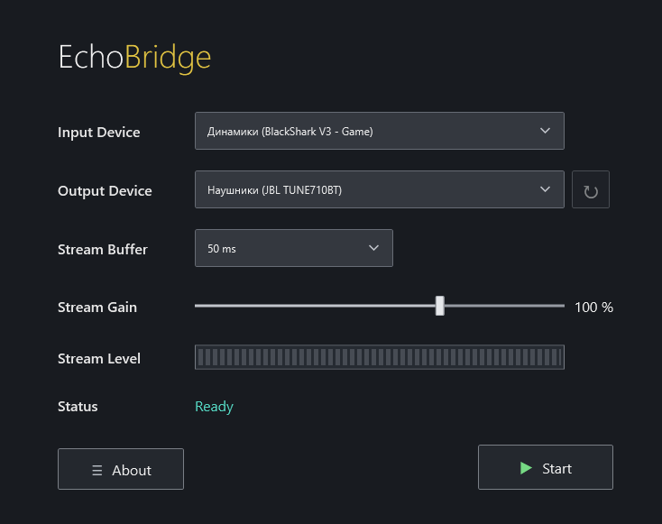

# EchoBridge

Небольшое приложение для Windows 11 x64, которое копирует уже воспроизводящийся звук с выбранного устройства воспроизведения на второе. Основное устройство продолжает играть само. Приложение не устанавливает драйверы и не создаёт виртуальные аудиоустройства.

## Скачать готовую версию

[Скачать последнюю версию EchoBridge](https://github.com/Pro100VlaD1CK/Audio-Repeater/releases/latest)

В разделе Releases скачайте `EchoBridge.exe`. Готовая версия предназначена для Windows 11 x64, публикуется как self-contained приложение и не требует отдельной установки .NET.



## Требования

- Windows 11 x64.
- Для опубликованного self-contained EXE отдельная установка .NET не нужна.
- Для сборки исходников: .NET 10 SDK и доступ к NuGet при первом `restore`.

## Использование

1. Скачайте готовую версию или соберите приложение по инструкции ниже и запустите `EchoBridge.exe`.
2. В **Input Device** выберите устройство воспроизведения, звук которого EchoBridge захватывает через WASAPI Loopback.
3. В **Output Device** выберите второе устройство, куда отправляется копия звука, например Bluetooth-колонку или Bluetooth-наушники.
4. Выберите буфер, при необходимости настройте усиление и нажмите **Start**.

## Буфер и задержка

- **10–25 ms** — проводные и быстрые устройства.
- **50 ms** — стандарт.
- **100–200 ms** — Bluetooth при обрывах или треске.

Это желаемая задержка WASAPI; устройство и драйвер могут согласовать другое значение. Bluetooth обычно добавляет собственную задержку кодека и радиоканала, поэтому два устройства могут звучать несинхронно. Выбор большего буфера повышает устойчивость, но не устраняет задержку Bluetooth. При переполнении буфер сбрасывает старый звук, чтобы задержка не росла без ограничений; при нехватке данных выводится тишина.

## Сборка

Из папки проекта:

```powershell
dotnet restore .\EchoBridge.csproj
dotnet build .\EchoBridge.csproj -c Release
dotnet publish .\EchoBridge.csproj -c Release -r win-x64 --self-contained true -p:PublishSingleFile=true -p:IncludeNativeLibrariesForSelfExtract=true -p:DebugType=None -p:DebugSymbols=false -o .\publish
```

Команда publish создаёт единственный файл `publish\EchoBridge.exe`. NAudio 3.1.0 подтягивается через NuGet. Целевая платформа — .NET 10 WPF, Windows x64.

## Данные и журналы

- Настройки: `%LOCALAPPDATA%\EchoBridge\settings.json`.
- Журналы: `%LOCALAPPDATA%\EchoBridge\logs\`.
- Файл журнала ограничен примерно 2 МБ; записи старше 14 дней удаляются.

Некорректный JSON настроек не препятствует запуску: используются значения по умолчанию.

## Структура исходников

- `MainWindow.xaml` / `MainWindow.xaml.cs` — WPF интерфейс и команды пользователя.
- `Audio/AudioDeviceService.cs` — перечисление render endpoints в состояниях Active и Unplugged.
- `Audio/AudioRepeaterService.cs` — захват конкретного endpoint, вывод и управление потоком.
- `Audio/GainMeterSampleProvider.cs` — усиление и индикатор пикового уровня.
- `Models/` — ID устройств и параметры приложения.
- `Services/` — JSON настройки и локальный журнал.
